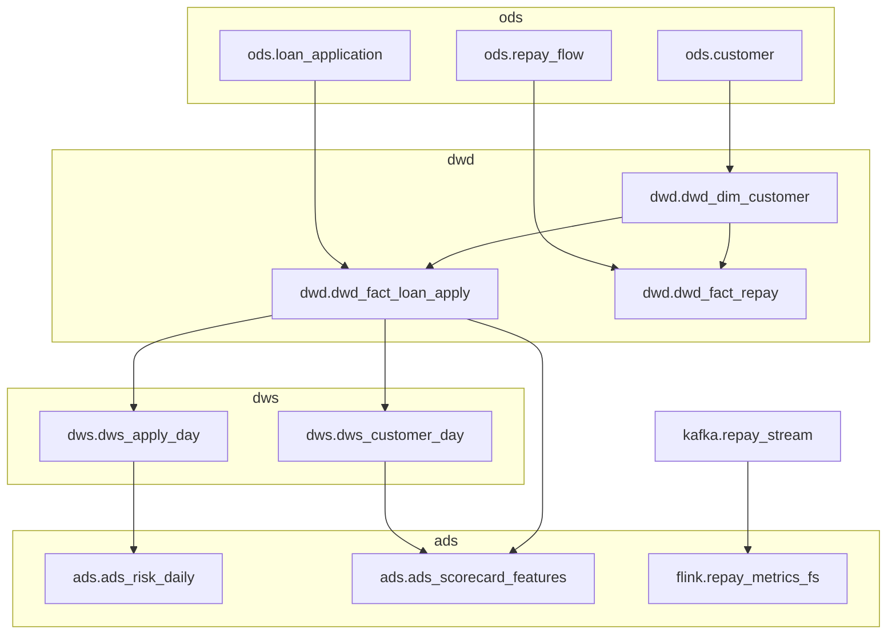

# 数仓表级血缘图

> 由 governance/render_lineage.py 从血缘注册表自动生成，请勿手改。

```mermaid
flowchart TD
    kafka_repay_stream["kafka.repay_stream"]
    subgraph ods
        ods_customer["ods.customer"]
        ods_loan_application["ods.loan_application"]
        ods_repay_flow["ods.repay_flow"]
    end
    subgraph dwd
        dwd_dwd_dim_customer["dwd.dwd_dim_customer"]
        dwd_dwd_fact_loan_apply["dwd.dwd_fact_loan_apply"]
        dwd_dwd_fact_repay["dwd.dwd_fact_repay"]
    end
    subgraph dws
        dws_dws_apply_day["dws.dws_apply_day"]
        dws_dws_customer_day["dws.dws_customer_day"]
    end
    subgraph ads
        ads_ads_risk_daily["ads.ads_risk_daily"]
        ads_ads_scorecard_features["ads.ads_scorecard_features"]
        flink_repay_metrics_fs["flink.repay_metrics_fs"]
    end
    dwd_dwd_dim_customer --> dwd_dwd_fact_loan_apply
    dwd_dwd_dim_customer --> dwd_dwd_fact_repay
    dwd_dwd_fact_loan_apply --> ads_ads_scorecard_features
    dwd_dwd_fact_loan_apply --> dws_dws_apply_day
    dwd_dwd_fact_loan_apply --> dws_dws_customer_day
    dws_dws_apply_day --> ads_ads_risk_daily
    dws_dws_customer_day --> ads_ads_scorecard_features
    kafka_repay_stream --> flink_repay_metrics_fs
    ods_customer --> dwd_dwd_dim_customer
    ods_loan_application --> dwd_dwd_fact_loan_apply
    ods_repay_flow --> dwd_dwd_fact_repay
```
